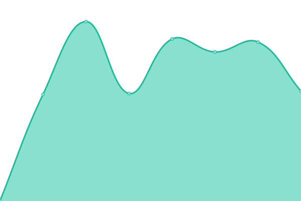
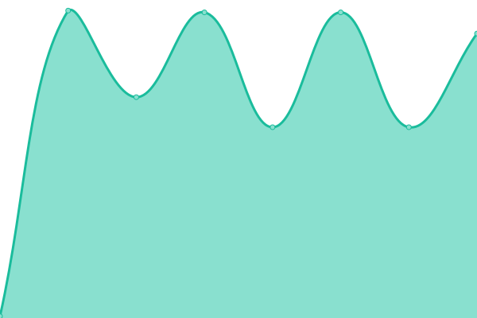
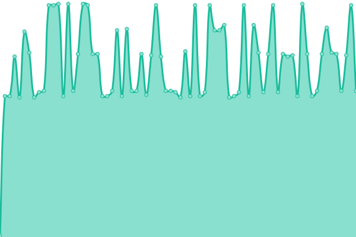

# [📈 Live Status](https://nilsjha.github.io/upptime-pub): <!--live status--> **🟧 Partial outage**

With [Upptime](https://upptime.js.org), you can get your own unlimited and free uptime monitor and status page, powered entirely by a GitHub repository. We use [Issues](https://github.com/nilsjha/upptime-pub/issues) as incident reports, [Actions](https://github.com/nilsjha/upptime-pub/actions) as uptime monitors, and [Pages](https://nilsjha.github.io/upptime-pub) for the status page.

<!--start: status pages-->
<!-- This summary is generated by Upptime (https://github.com/upptime/upptime) -->
<!-- Do not edit this manually, your changes will be overwritten -->
<!-- prettier-ignore -->
| URL | Status | History | Response Time | Uptime |
| --- | ------ | ------- | ------------- | ------ |
|  Southbound DE-HEF-DC-CL | 🟩 Up | [southbound-de-hef-dc-cl.yml](https://github.com/nilsjha/upptime-pub/commits/HEAD/history/southbound-de-hef-dc-cl.yml) | 

 613ms
     
 | 

<a href="https://nilsjha.github.io/upptime-pub/history/southbound-de-hef-dc-cl">100.00%</a>
    

|  Eastend FI-HEL-DC-CL | 🟩 Up | [eastend-fi-hel-dc-cl.yml](https://github.com/nilsjha/upptime-pub/commits/HEAD/history/eastend-fi-hel-dc-cl.yml) | 

 146ms
     
 | 

<a href="https://nilsjha.github.io/upptime-pub/history/eastend-fi-hel-dc-cl">100.00%</a>
    

|  Northridge NO-VLG-DC-LS | 🟥 Down | [northridge-no-vlg-dc-ls.yml](https://github.com/nilsjha/upptime-pub/commits/HEAD/history/northridge-no-vlg-dc-ls.yml) | 

 910ms
     
 | 

<a href="https://nilsjha.github.io/upptime-pub/history/northridge-no-vlg-dc-ls">37.03%</a>
    

|  Northridge NO-VLG-DC-LN | 🟥 Down | [northridge-no-vlg-dc-ln.yml](https://github.com/nilsjha/upptime-pub/commits/HEAD/history/northridge-no-vlg-dc-ln.yml) | 

 1016ms
     
 | 

<a href="https://nilsjha.github.io/upptime-pub/history/northridge-no-vlg-dc-ln">37.21%</a>
    

|  Coasthill NO-MRA-EC-LE | 🟩 Up | [coasthill-no-mra-ec-le.yml](https://github.com/nilsjha/upptime-pub/commits/HEAD/history/coasthill-no-mra-ec-le.yml) | 

 694ms
     
 | 

<a href="https://nilsjha.github.io/upptime-pub/history/coasthill-no-mra-ec-le">100.00%</a>
    

|  DNS-S1 | 🟩 Up | [dns-s1.yml](https://github.com/nilsjha/upptime-pub/commits/HEAD/history/dns-s1.yml) | 

 139ms
     
 | 

<a href="https://nilsjha.github.io/upptime-pub/history/dns-s1">100.00%</a>
    

|  DNS-S2 | 🟩 Up | [dns-s2.yml](https://github.com/nilsjha/upptime-pub/commits/HEAD/history/dns-s2.yml) | 

 136ms
     
 | 

<a href="https://nilsjha.github.io/upptime-pub/history/dns-s2">59.49%</a>
    

<!--end: status pages-->

[**Visit our status website →**](https://nilsjha.github.io/upptime-pub)

## 📄 License

- Powered by: [Upptime](https://github.com/upptime/upptime)
- Code: [MIT](./LICENSE) © [nilsjha](https://nilsjha.github.io/upptime-pub)
- Data in the `./history` directory: [Open Database License](https://opendatacommons.org/licenses/odbl/1-0/)
